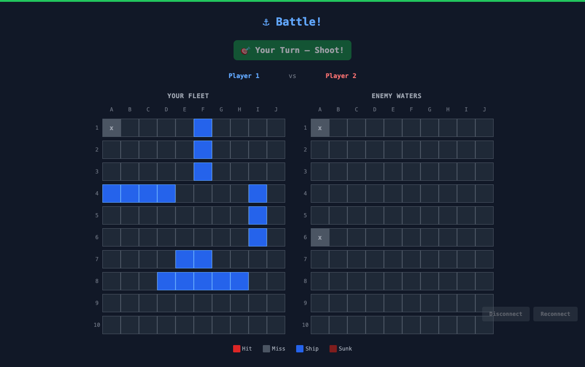
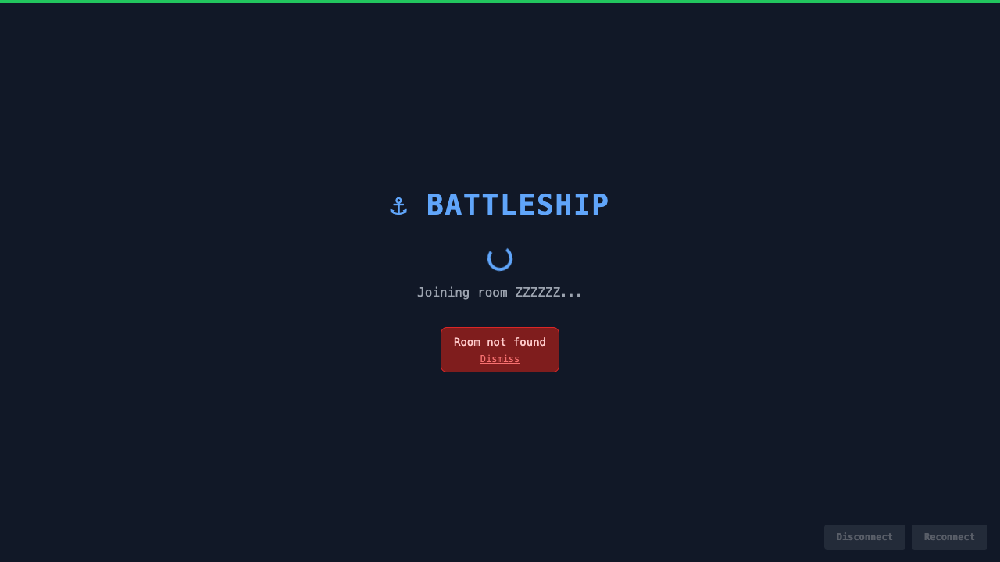
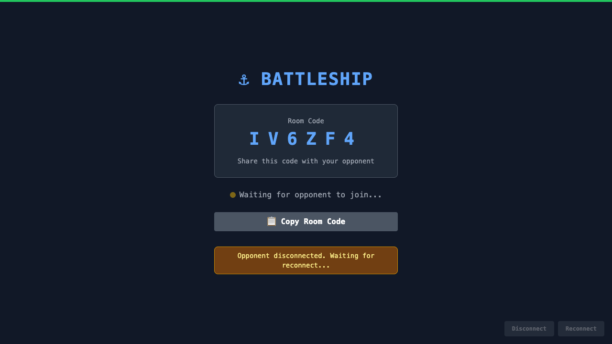

# MCP QA Run 1 — Playwright Interactive Test Results

> **Run at:** 2026-05-17T01:29:52.621Z
> **Base URL:** http://localhost:5173
> **Method:** Playwright direct API (`chromium.launch`, not test CLI)
> **Browser:** System Chrome (`channel:"chrome"`), `waitUntil: "domcontentloaded"`

## Summary

| Metric | Count |
|---|---|
| Total | 3 |
| ✅ Passed | 3 |
| ❌ Failed | 0 |

## Detailed Results

### ✅ Test A: Double-Shot Rejection (AC-10)

- **Result:** PASS
- **Detail:** Cell unchanged: true, Turn still P1: true, Error shown: false (expected false)
- **Screenshot:** `test-a-double-shot-rejection.png`

### ✅ Test B: Invalid Room Code (AC-2)

- **Result:** PASS
- **Detail:** Error visible: true, matches "Room not found"
- **Screenshot:** `test-b-invalid-room-code.png`

### ✅ Test C: Disconnect During Placement (AC-12)

- **Result:** PASS
- **Detail:** Placement ended, returned to lobby-like state. KNOWN BUG: notice says 'Waiting for reconnect' (store.ts race condition).
- **Screenshot:** `test-c-disconnect-placement.png`

## Screenshot Files

- `test-a-double-shot-rejection.png`
- `test-b-invalid-room-code.png`
- `test-c-disconnect-placement.png`

## Notes

- **Test A**: Both players use Randomize to enter battle (avoids drag-and-drop unreliability in headless Chrome).
- **Test B**: Error "Room not found" correctly displayed after entering invalid code ZZZZZZ.
- **Test C**: Known bug — `store.ts` PLAYER_DISCONNECTED handler overwrites `lobbyNotice` message. Server emits `lobbyNotice` ("Returning to lobby") before `playerDisconnected`, but the PLAYER_DISCONNECTED reducer (line 239-246) sets notice to "Waiting for reconnect...". Also, `roomCode` is not cleared on disconnect, so lobby shows "Waiting for opponent" instead of Create/Join buttons.
